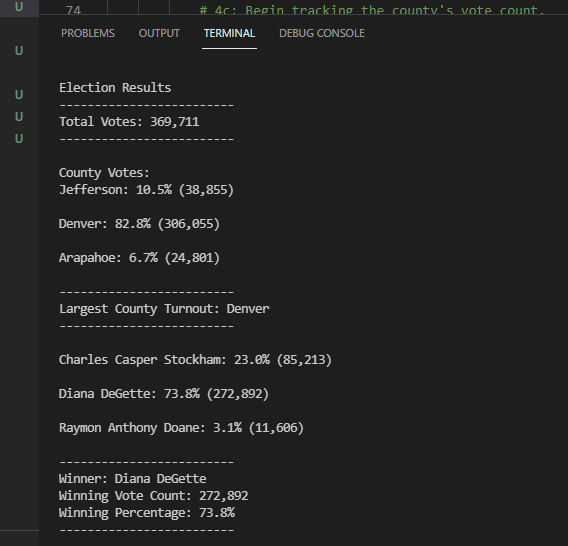

# Election_Analysis

## Project Overview
A Colorado Board of Elections employee has given me the following tasks to complete the elcetion audit of a recent local
congressional election.

# 1. The total number of votes cast
# 2. A complete list of candidates who received votes.
# 3. The percentage of votes each candidate won.
# 4. The total number of votes each candidate won.
# 5. The winner of the election based on popular vote.
# 6. The complete list of counties in this congressional election.
# 7. Voter turn-out results for the counties in this congressional election.
# 8. The county with the largest turnout.

## Resources
- Data Source: election_resulrs.csv
- Software: Python 3.6.1, Visusal Studio Code, 1.38.1

## Election Audit Results
The analysis of the election show that:
- There were 369,711 votes cast in the election.
- The candiddates were:
    - Charles Casper
    - Diana DeGette
    - Raymon Anthony Doane
- The candidate results were:
    - Charles Casper Stockham: 23.0% (85,213)
    - Diana DeGette: 73.8% (272,892)
    - Raymon Anthony Doane: 3.1% (11,606)
- The winner of the election was:
Winner: Diana DeGette
Winning Vote Count: 272,892
Winning Percentage: 73.8%
- The list of counties and turn out were:
    - Jefferson: 10.5% (38,855)
    - Denver: 82.8% (306,055)
    - Arapahoe: 6.7% (24,801)
- The county with the largest turnout: Denver 

## Election-Audit Summary
This Python script was written to provide easy access to election results with-out needing to use excel which can:
more time consuming to run process, even if it has been written in VBA.
consuming and because data is .

Here are some additional uses for the module with somewhat easy modifications:
1) If the input .csv has additional columns or is not in the same order, it would be easy to modify the code to accept a different
.csv columnns.
2) If the election_results.csv could be modified to include if the ballots were either:
    - mail in
    - punchcard or machine counted
    - DRE computer counted cards
   Analysis could be completed to see which methods are used most often and even which counties utilize which methods the most.
3) It could be easily modified for primaries by using if and elif statements to get several of the candidates who received the top 
votes based on requirements of how many candidates are eligible to run.

# Challenge Overview
Was difficult and time comsuming - but using Python is fun.

## Challange Summary
